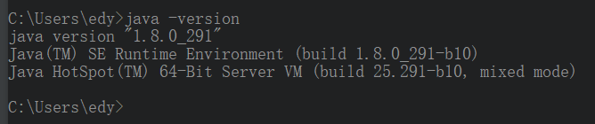

## jdk浅薄理解

>jdk —— Java Development ToolKit(java开发工具包)
> + jdk主要是用于java开发
> * 所以写代码必需哟

>jre —— Java Runtime Environment(java运行环境)
> + jre主要用于java程序运行时提供环境
> - 所以不需要jdk也可以运行程序

>细心的同学会发现jdk目录下有个jre目录，该目录和外边那个jre目录及其相似
> + 没毛病，它们都是提供运行环境的，不过jdk下面的那个是私有的，而外边那个jre是公有的
> - 我猜测私有的是为了给jdk下面的jar提供运行环境的

>jdk 安装并配置
> + 安装的话去oracle官网下载安装即可
> - 配置>系统环境>Path 和 ClassPath
>
>> * 0、新建JAVA_HOME
>>> + C:\Program Files\Java\jdk1.8.0_291
>> * 1、配置Path
>>> + %JAVA_HOME%\bin;%JAVA_HOME%\jre\bin;
>> * 2、配置CLASSPATH
>>> + .;%JAVA_HOME%\lib;%JAVA_HOME%\lib\tools.jar;%JAVA_HOME%\lib\dt.jar
>> * 3、打开控制台输入 java -version 出现如下图就意味着配置成功
     

>环境变量配置的意义
> * JAVA_HOME：方便后续配置，可以当做给jdk路径起个名字
> * 配置Path：方便在任何目录去直接执行jdk目录下命令
>> + java.exe：将java程序进行编译成字节码文件
>> + javac.exe：执行字节码文件
>> + Path配置JAVA_HOME\bin：因为这个目录有java.exe javac.exe
>> + Path配置JAVA_HOME\jre\bin：提供运行环境
> * 配置CLASSPATH：就是jdk目录下的jar位置，这些jar开发时可能会需要
